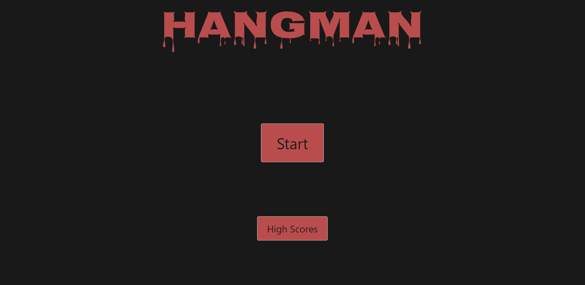
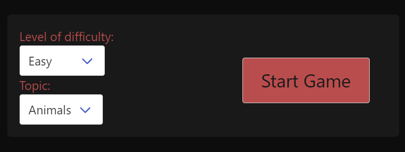
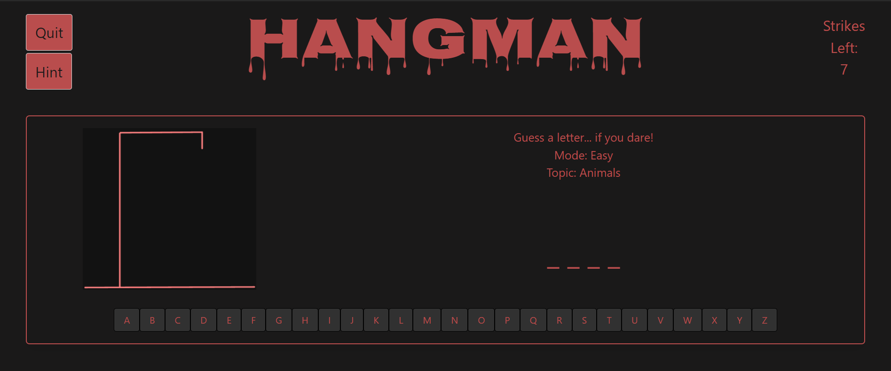
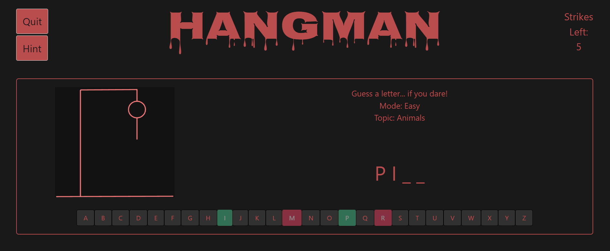
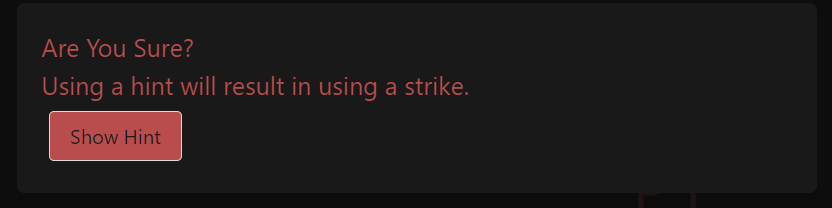
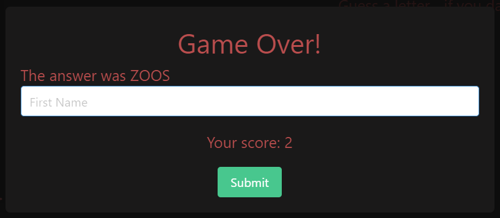
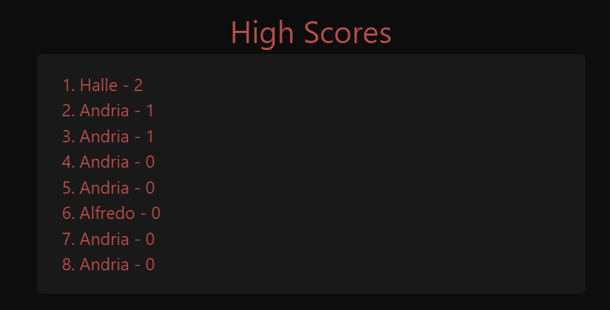

# Project Hangman

## Description

User Story:
As a bootcamp student
I want to play a game to take a break from studying
so that I do not throw my computer

We built this project to test our knowledge of HTML, CSS, and JavaScript. Now we have a website that showcases our combined knowledge and a really fun game to play in our passtimes. We learned how to read documentation to use an unfamiliar CSS framework. We also learned more about pulling information from APIs and applying it it a way that can be fun.

## Installation

No installation required. Link to deployed application provided below:

https://andria-goodwin.github.io/project-hangman/

## Usage

Project Hangman opens up on a start screen with a start button and high scores button.

To play the game you would click the start button and input your difficulty level and topic choice.

Then when you click start again you will be redirected to the game page.

You can click the letter buttons to guess the word. Wrong letters will turn red and correct letter will turn green and be added to the word.

You can also click the hint button in the upper left hand corner for a hint, but it warns you that you will use a strike if you do first.

When the game is over you will be presented with a Game Over modal where you can input your name to save your score. it will also tell you what the last word was.

If you'd like to see your saved scores, you can find them by clicking the high scores button on the start screen.

## Credits

Collin Shepherd - https://github.com/collinshepherd
Alfredo Mercado - https://github.com/amercado94
Halle Podolanko - https://github.com/HalleNotHaley
Andria Goodwin - https://github.com/andria-goodwin

## License

Please refer to the LICENSE in the repo.

